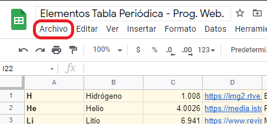
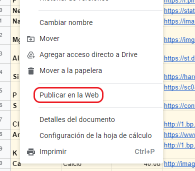
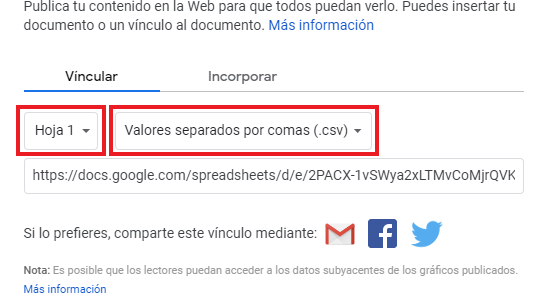
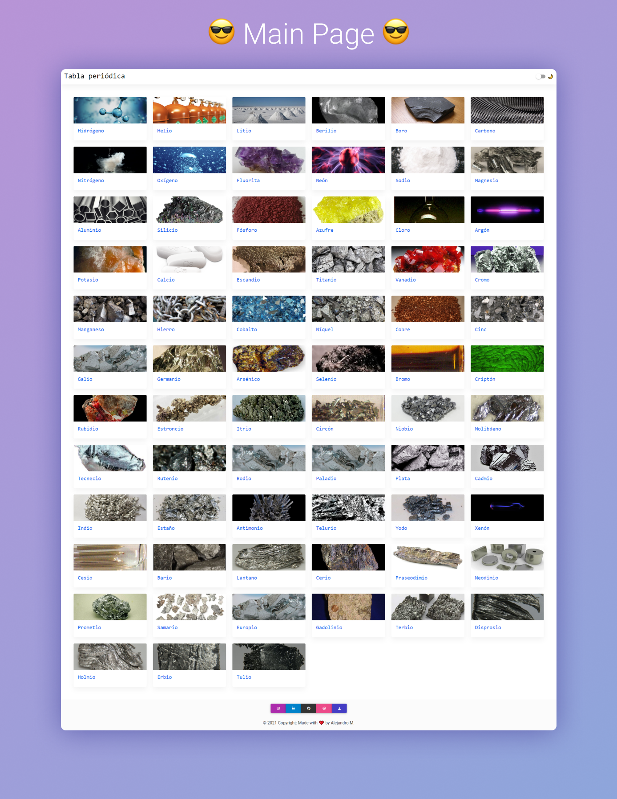

<h1>periodic-table</h1>

This is a periodic table web created with <strong>PHP, HTML, SCSS & JS</strong>. I used <a href="https://mdbootstrap.com">MD Bootstrap</a> 
for the design and Google Sheets as DB to retrieve data

<h1>Features</h1>
<ul>
    <li>You can see all the retrieved elements.</li>
    <li>Click an element to see more info.</li>
    <li>Modify data from Google Sheets.</li>
</ul>

<h1>Installation</h1>

Installation is pretty simple, in this case due to the backend language which is PHP you'll only need to install <a href="https://www.apachefriends.org/index.html">XAMPP</a> or another php development environment.

In XAMPP you need to start a server with apache module and open the folder of the project, and it's done!.

<h3>How to add a new Google Sheets?</h3>

If you want to replace the Google Sheets it's pretty simple!.  
Create a new Google Sheet, take in count the columns (Symbol, Name of element, Atomic weight, img url, things in the life related with the element, *hex color, this one is not mandatory to add but it's cool to change colors of cards by adding a hex color*).<strong> With the new GSheet created and data follow the next steps: </strong>

<h5>1. Go to File</h5>

<h5>2. Publish in the web</h5>

<h5>3. Select a sheet and it's mandatory to select the comma separated values .csv file</h5>

Google sheets will return a link underneath the dropdown lists which is important to copy and paste in the <code>data.php</code> file in line 3.

<code>
<?php
function getData(){
    $csv = array_map('str_getcsv', file('HERE IS WHERE YOU MUST PLACE THE LINK PROVIDED BY GSHEETS'));
    return $csv;
}
?>
</code>

It takes some seconds to work but after that you're supposed to see all of your own data in the project.

 

 

 
